<p align="center">
  
</p>

<p align="center">
  
</p>

---

## 👨‍💻 About Me

```python
class KalpeshBhoir:
    role     = "Computer Vision & Deep Learning Engineer"
    location = "India"

    expertise = [
        "Real-Time Video Analysis & Object Detection",
        "Convolutional Neural Networks (CNNs)",
        "OpenCV & Image Processing Pipelines",
        "Deep Learning Model Training & Optimization",
        "Instance & Semantic Segmentation",
        "Pose Estimation & Action Recognition",
        "Edge Deployment (ONNX / TensorRT / OpenVINO)",
        "Data Augmentation & Transfer Learning",
    ]

    currently_working_on = [
        "High-accuracy real-time detection pipelines",
        "Optimizing CV models for edge/embedded devices",
        "Exploring Vision Transformers (ViTs) & CLIP",
    ]

    fun_fact = "I see the world one frame at a time — literally 🎥"
```

---

## 🔭 Current Focus

- 🧠 Building **real-time computer vision systems** using OpenCV, YOLO, and PyTorch  
- ⚡ Optimizing deep learning models for **low-latency edge inference**  
- 🔬 Exploring **Vision Transformers** and multimodal vision-language models  
- 🛠️ Developing robust **video analytics pipelines** for surveillance & automation use cases  

---

## 🛠️ Tech Stack

### 🤖 AI / ML / CV


### 🌐 Web & Backend


### ⚙️ DevOps & Tools


---

## 📊 GitHub Stats

<p align="center">
  
  
</p>

<p align="center">
  
</p>

---

## 🤝 Connect with Me

<p align="left">
  <a href="https://linkedin.com/in/YOUR_LINKEDIN" target="_blank">
    
  </a>
  <a href="mailto:YOUR_EMAIL">
    
  </a>
  <a href="https://github.com/bhoirkalpesh" target="_blank">
    
  </a>
</p>

---

<p align="center"><i>"Every pixel tells a story. I just teach machines to read them."</i></p>
